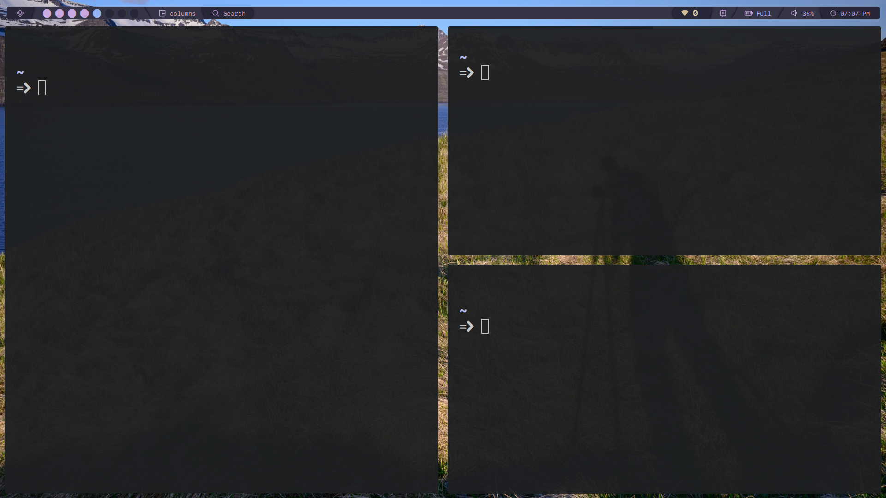
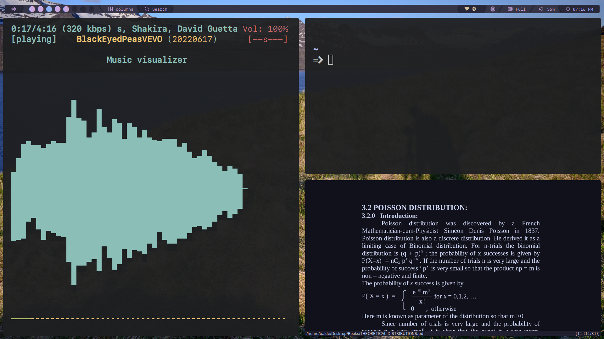

# My Lovely Qtile configuration

**Note**: If you want to have the same configuration, you only need to copy the qtile file here and paste it under your "Home/.config" directory.




## KEYBINDS

<details>
<summary>Table</summary>

| Key                                                     | Bind                                            |
| :------------------------------------------------------ | :---------------------------------------------- |
|                                                         |                                                 |
| **Qtile Defaults**                                      |                                                 |
|                                                         |                                                 |
| <kbd>super</kbd> + <kbd>h</kbd>                         | Move focus to left                              |
| <kbd>super</kbd> + <kbd>l</kbd>                         | Move focus to right                             |
| <kbd>super</kbd> + <kbd>j</kbd>                         | Move focus to down                              |
| <kbd>super</kbd> + <kbd>k</kbd>                         | Move focus to up                                |
| <kbd>super</kbd> + <kbd>space</kbd>                     | Move window focus to other window               |
| <kbd>super</kbd> + <kbd>control</kbd> + <kbd>h</kbd>    | Move window to the left                         |
| <kbd>super</kbd> + <kbd>control</kbd> + <kbd>l</kbd>    | Move window to the right                        |
| <kbd>super</kbd> + <kbd>control</kbd> + <kbd>j</kbd>    | Move window to the down                         |
| <kbd>super</kbd> + <kbd>control</kbd> + <kbd>k</kbd>    | Move window to the up                           |
| <kbd>super</kbd> + <kbd>shift</kbd> + <kbd>h</kbd>      | Grow windows to the left                        |
| <kbd>super</kbd> + <kbd>shift</kbd> + <kbd>l</kbd>      | Grow windows to the right                       |
| <kbd>super</kbd> + <kbd>shift</kbd> + <kbd>j</kbd>      | Grow windows to the down                        |
| <kbd>super</kbd> + <kbd>shift</kbd> + <kbd>k</kbd>      | Grow windows to the up                          |
| <kbd>super</kbd> + <kbd>n</kbd>                         | Reset all window sizes                          |
| <kbd>super</kbd> + <kbd>f</kbd>                         | Toggle fullscreen                               |
| <kbd>super</kbd> + <kbd>shift</kbd> + <kbd>Return</kbd> | Toggle between split and unsplit sides of stack |
| <kbd>super</kbd> + <kbd>Tab</kbd>                       | Toggle between layouts                          |
| <kbd>super</kbd> + <kbd>Control</kbd> + <kbd>r</kbd>    | Restart Qtile                                   |
| <kbd>super</kbd> + <kbd>Control</kbd> + <kbd>q</kbd>    | Shutdown Qtile                                  |
|                                                         |                                                 |
| **Custom**                                              |                                                 |
|                                                         |                                                 |
| <kbd>super</kbd> + <kbd>Return</kbd>                    | Launch Terminal                                 |
| <kbd>super</kbd> + <kbd>w</kbd>                         | Close/Kill focused window                       |
| <kbd>super</kbd> + <kbd>r</kbd>                         | App launcher/ Rofi Drun                         |
| <kbd>super</kbd> + <kbd>p</kbd>                         | Rofi Powermenu                                  |
| <kbd>super</kbd> + <kbd>t</kbd>                         | **Rofi Theme_switcher**                         |
| <kbd>super</kbd> + <kbd>e</kbd>                         | Naturus File manager                            |
| <kbd>super</kbd> + <kbd>s</kbd>                         | Flameshot (Screenshot)                          |
| <kbd>super</kbd> + <kbd>h</kbd>                         | Roficlip                                        |

</details>

---

## How to use my config

if you have qtile then make sure the create a backup because I don't garantie you it will work exactly as mine.</br>
` git clone https://github.com/abdoulayegk/Qtile-cong.git`
</br>
after you clone it then move the Qtile-cong directory </br>

`mv qtile ~/.config`

## Error on arch linux **man** command:

This is the error message that I got after running the command man ls: `man: can't execute most: No such file or directory
man: command exited with status 255: LESS=-ix8RmPm Manual page bash(1) ?ltline %lt?L/%L.:byte %bB?s/%s..?e (END):?pB %pB\%.. (press h for help or q to quit)$PM Manual page bash(1) ?ltline %lt?L/%L.:byte %bB?s/%s..?e (END):?pB %pB\%.. (press h for help or q to quit)$ MAN_PN=bash(1) most`</br>

- The solution was just to run this command:
  `bash export MANPAGER=less `

  link to the solution page [Archwiki](https://bbs.archlinux.org/viewtopic.php?id=178730)<br>
  I use this nice and beautiful terminal final manager [Yazi final manager](https://yazi-rs.github.io/docs/installation/) <br>

## Must have packages for volume and brightness control
`sudo pacman -S alsa-utils lxappearance brightnessctl`
## Bluetooth connection
1. `sudo pacman -S bluez bluez-utils blueman`
 2. `sudo systemctl start bluetooth`
  3. `sudo systemctl enable bluetooth
`
# To install and configer lightdm
1. install [lightdm](https://github.com/NoiSek/Aether) with the following command ``` paru -S lightdm-webkit-theme-aether```
2. Go to ```cd /etc/lightdm``` change default sessions to qtile then save exit
3. Enable it with the following ```sudo systemctl start lightdm.service && sudo systemctl enable lightdm.service -f```.
4. Reboot.


## Others
Install pip using pacman
``
sudo pacman -S python-pip
``
After this you need to install qtile dependencies
1. `pip install dbus-next`

  ## Changing the Default Desktop Environment
  * Go to ``sudo nvim /etc/lightdm/lightdm.conf`` and search for **user-session=default** and CHANGE THIS to qtile
 
# To Fix gnome right click and left click(touchpad)
Run the following command: ``gsettings set org.gnome.desktop.peripherals.touchpad \ click-method areas`` and then done.

  

#### Have a nice day!

## **BTW I USE ARCH**
