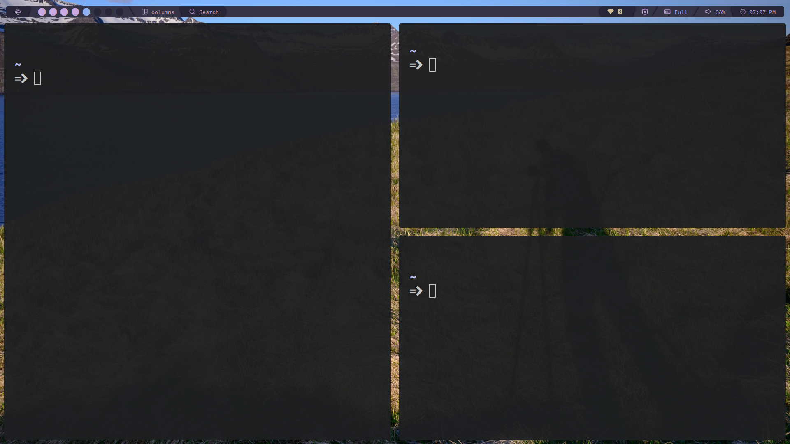
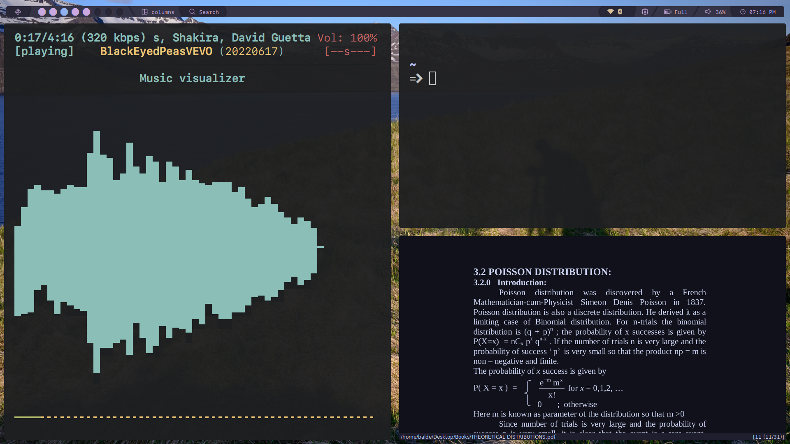

# My Lovely Qtile configuration

## KEYBINDS

<h3>Table</h3>

| Key                                                     | Bind                                            |
| :------------------------------------------------------ | :---------------------------------------------- |
|                                                         |                                                 |
| Qtile Defaults                                          |                                                 |
|                                                         |                                                 |
| <kbd>super</kbd> + <kbd>h</kbd>                         | Move focus to left                              |
| <kbd>super</kbd> + <kbd>l</kbd>                         | Move focus to right                             |
| <kbd>super</kbd> + <kbd>j</kbd>                         | Move focus to down                              |
| <kbd>super</kbd> + <kbd>k</kbd>                         | Move focus to up                                |
| <kbd>super</kbd> + <kbd>space</kbd>                     | Move window focus to other window               |
| <kbd>super</kbd> + <kbd>control</kbd> + <kbd>h</kbd>    | Move window to the left                         |
| <kbd>super</kbd> + <kbd>control</kbd> + <kbd>l</kbd>    | Move window to the right                        |
| <kbd>super</kbd> + <kbd>control</kbd> + <kbd>j</kbd>    | Move window to the down                         |
| <kbd>super</kbd> + <kbd>control</kbd> + <kbd>k</kbd>    | Move window to the up                           |
| <kbd>super</kbd> + <kbd>shift</kbd> + <kbd>h</kbd>      | Grow windows to the left                        |
| <kbd>super</kbd> + <kbd>shift</kbd> + <kbd>l</kbd>      | Grow windows to the right                       |
| <kbd>super</kbd> + <kbd>shift</kbd> + <kbd>j</kbd>      | Grow windows to the down                        |
| <kbd>super</kbd> + <kbd>shift</kbd> + <kbd>k</kbd>      | Grow windows to the up                          |
| <kbd>super</kbd> + <kbd>n</kbd>                         | Reset all window sizes                          |
| <kbd>super</kbd> + <kbd>f</kbd>                         | Toggle fullscreen                               |
| <kbd>super</kbd> + <kbd>shift</kbd> + <kbd>Return</kbd> | Toggle between split and unsplit sides of stack |
| <kbd>super</kbd> + <kbd>Tab</kbd>                       | Toggle between layouts                          |
| <kbd>super</kbd> + <kbd>Control</kbd> + <kbd>r</kbd>    | Restart Qtile                                   |
| <kbd>super</kbd> + <kbd>Control</kbd> + <kbd>q</kbd>    | Shutdown Qtile                                  |
|                                                         |                                                 |
| Custom                                                  |                                                 |
|                                                         |                                                 |
| <kbd>super</kbd> + <kbd>Return</kbd>                    | Launch Terminal                                 |
| <kbd>super</kbd> + <kbd>c</kbd>                         | Close/Kill focused window                       |
| <kbd>super</kbd> + <kbd>r</kbd>                         | App launcher/ Rofi Drun                         |
| <kbd>super</kbd> + <kbd>p</kbd>                         | Rofi Powermenu                                  |
| <kbd>super</kbd> + <kbd>t</kbd>                         | **Rofi Theme_switcher**                         |
| <kbd>super</kbd> + <kbd>e</kbd>                         | Thunar File manager                             |
| <kbd>super</kbd> + <kbd>s</kbd>                         | Flameshot (Screenshot)                          |
| <kbd>super</kbd> + <kbd>h</kbd>                         | Roficlip                                        |

div>

---

#### Have a nice day!

